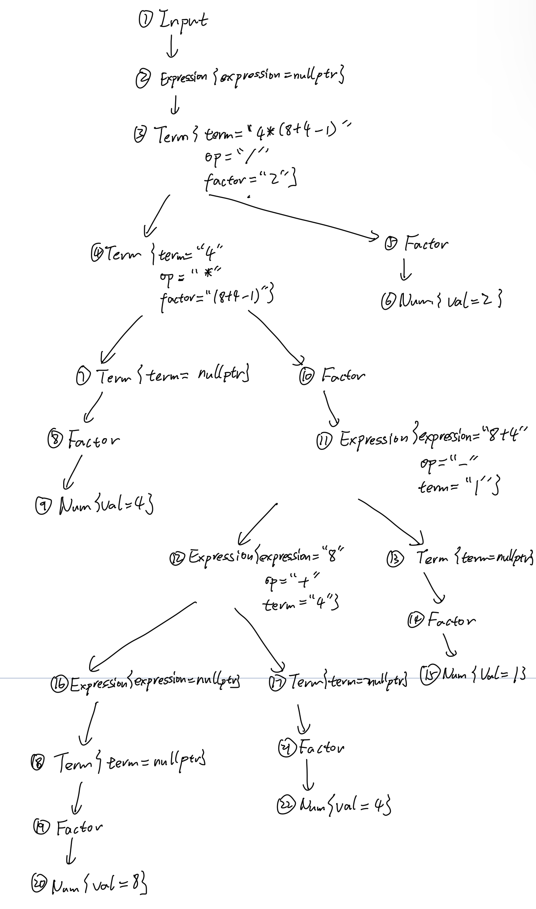

# lab2 实验报告
PB1907\*\*\*\* 李平治

## 问题1: cpp 与 .ll 的对应
请说明你的 cpp 代码片段和 .ll 的每个 BasicBlock 的对应关系。

> 注：以下的`.ll `代码均为自己写的版本

### Assign

#### assign_generator.cpp

```c++
int main(){
    auto module = new Module("Cminus code");  // module name是什么无关紧要
    auto builder = new IRBuilder(nullptr, module);
    Type *Int32Type = Type::get_int32_type(module);
    // main函数
    auto mainFun = Function::create(FunctionType::get(Int32Type, {}),
                                  "main", module);
    auto bb = BasicBlock::create(module, "entry", mainFun);
    builder->set_insert_point(bb);
    
    auto retAlloca = builder->create_alloca(Int32Type);
    builder->create_store(CONST_INT(0), retAlloca);             // 默认 ret 0
    
    auto *arrayType = ArrayType::get(Int32Type, 10);
    auto aAlloca = builder->create_alloca(arrayType);    // Allocate a[10]

    auto a0GEP = builder->create_gep(aAlloca, {CONST_INT(0), CONST_INT(0)});
    builder->create_store(CONST_INT(10), a0GEP);        // a[0] = 10
    auto a1GEP = builder->create_gep(aAlloca, {CONST_INT(0), CONST_INT(1)});
    auto a0Load = builder->create_load(a0GEP);
    auto mul = builder->create_imul(a0Load, CONST_INT(2));  // get a[0]*2
    builder->create_store(mul, a1GEP);
    auto a1Load = builder->create_load(a1GEP);
    builder->create_ret(a1Load);

    std::cout << module->print();
    delete module;
    return 0;
}
```

#### assign_hand.ll

```assembly
define dso_local i32 @main() #0 {
    %1 = alloca i32, align 4            
    %2 = alloca [10 x i32], align 4
    store i32 0, i32* %1, align 4                               ; %1 = 0, in main function
    %3 = getelementptr [10 x i32], [10 x i32]* %2, i32 0, i32 0 ; %3 = & a[0]
    store i32 10, i32* %3, align 4                              ; %3 = 10
    %4 = load i32, i32* %3, align 4                             ; %4 = a[0]
    %5 = mul nsw i32 %4, 2                                      ; %5 = %4 * 2                        
    %6 = getelementptr [10 x i32], [10 x i32]* %2, i32 0, i32 1 ; %6 = & a[1]
    store i32 %5, i32* %6, align 4                              ; a[1] = %5
    %7 = load i32, i32* %6, align 4                             ; %7 = a[1]
    ret i32 %7
}
```

#### BasicBlocks对应关系

* `BasicBlock::create(module, "entry", mainFun)` 对应 `mian` 函数中的label `0` 


### Fun

#### fun_generator.cpp

```c++
int main(){
    auto module = new Module("Cminus code");  // module name是什么无关紧要
    auto builder = new IRBuilder(nullptr, module);
    Type *Int32Type = Type::get_int32_type(module);

    // callee function
    std::vector<Type *> Ints(1, Int32Type);     // function parameter
    auto calleeFun = Function::create(FunctionType::get(Int32Type, Ints), "callee", module);
    
    auto bb = BasicBlock::create(module, "entry", calleeFun);
    builder->set_insert_point(bb);  

    auto retAlloca = builder->create_alloca(Int32Type);

    auto aAlloca = builder->create_alloca(Int32Type);   // allocate a

    std::vector<Value* > args;  // 获取callee函数的形参,通过Function中的iterator
    for (auto arg = calleeFun->arg_begin(); arg!=calleeFun->arg_end(); arg++) {
        args.push_back(*arg);
    }

    builder->create_store(args[0], aAlloca);
    auto aLoad = builder->create_load(aAlloca);
    auto mul = builder->create_imul(CONST_INT(2), aLoad);
    builder->create_store(mul, retAlloca);

    auto retLoad = builder->create_load(retAlloca);
    builder->create_ret(retLoad);

    // main function
    auto mainFun = Function::create(FunctionType::get(Int32Type, Ints), "main", module);
    bb = BasicBlock::create(module, "entry", mainFun);

    builder->set_insert_point(bb);
    retAlloca = builder->create_alloca(Int32Type);
    builder->create_store(CONST_INT(0), retAlloca);     // defaultly return 0

    auto call = builder->create_call(calleeFun, {CONST_INT(110)});
    builder->create_ret(call);

    std::cout << module->print();
    delete module;
    return 0;
}
```

#### fun_hand.ll

```assembly
define dso_local i32 @callee(i32 %0) #1 {
    %2 = alloca i32, align 4              
    store i32 %0, i32* %2, align 4        ; %2 = %0
    %3 = load i32, i32* %2, align 4       ; %3 = %2
    %4 = mul nsw i32 2, %3                ; %4 = 2 * %3
    ret i32 %4
}

define dso_local i32 @main() #0 {
    %1 = alloca i32, align 4            
    store i32 0, i32* %1, align 4         ; %1 = 0, in main function
    %2 = call i32 @callee(i32 110)
    ret i32 %2
}
```

#### BasicBlocks对应关系

* `BasicBlock::create(module, "entry", calleeFun)` 对应 `callee` 函数中的label `0`
* `BasicBlock::create(module, "entry", mainFun)` 对应 `main` 函数中的label `0`


### If

#### if_generator.cpp

```c++
int main(){
    auto module = new Module("Cminus code"); // module name是什么无关紧要
		auto builder = new IRBuilder(nullptr, module);
		Type *Int32Type = Type::get_int32_type(module);
		Type *FloatType = Type::get_float_type(module);

    // main function
    auto mainFun = Function::create(FunctionType::get(Int32Type, {}),
									"main", module);
		auto bb = BasicBlock::create(module, "entry", mainFun);
    builder->set_insert_point(bb);

    auto retAlloca = builder->create_alloca(Int32Type); 
		builder->create_store(CONST_INT(0), retAlloca);     // defautly return 0

    auto aAlloca = builder->create_alloca(FloatType);   
		builder->create_store(CONST_FP(5.555), aAlloca);    // a = 5.555

    auto aLoad = builder->create_load(aAlloca);
    auto fcmp = builder->create_fcmp_gt(aLoad, CONST_FP(1));

    auto trueBB = BasicBlock::create(module, "trueBB", mainFun);    // true分支
    auto falseBB = BasicBlock::create(module, "falseBB", mainFun);  // false分支
    auto retBB = BasicBlock::create(module, "", mainFun);

    auto br = builder->create_cond_br(fcmp, trueBB, falseBB);   //conditional branch 
    
    builder->set_insert_point(trueBB);          //  if true
    builder->create_store(CONST_INT(233), retAlloca);
    builder->create_br(retBB);

    builder->set_insert_point(falseBB);         //  if false
    builder->create_store(CONST_INT(0), retAlloca);
    builder->create_br(retBB);

    builder->set_insert_point(retBB);
    auto retLoad = builder->create_load(retAlloca);
    builder->create_ret(retLoad);
    
    std::cout << module->print();
    delete module;
    return 0;
}
```

#### if_hand.ll

```assembly
define dso_local i32 @main() #0 {
    %1 = alloca i32, align 4
    %2 = alloca float, align 4
    store i32 0, i32* %1, align 4                       ; %1 = 0, in main function
    store float 0x40163851E0000000, float* %2, align 4  ; %2 = 5.555
    %3 = load float, float* %2, align 4                 ; %3 = %2
    %4 = fcmp ogt float %3, 1.0
    br i1 %4, label %5, label %6

5:                                                      ; preds = %0
    store i32 233, i32* %1, align 4
    br label %7

6:                                                      ; preds = %0
    store i32 0, i32* %1, align 4
    br label %7

7:                                                      ; preds = %6, %5
    %8 = load i32, i32* %1, align 4
    ret i32 %8
}
```

#### BasicBlocks对应关系

* `bb = BasicBlock::create(module, "entry", mainFun)`  对应 `main` 函数中的label `0`
* `trueBB = BasicBlock::create(module, "trueBB", mainFun)` 对应 `main` 函数中的 label `5` 
* `falseBB = BasicBlock::create(module, "falseBB", mainFun)` 对应 `main` 函数中的 label `6`
* ``retBB = BasicBlock::create(module, "", mainFun)` 对应 `main` 函数中的 label `7`


### While

#### while_generator .cpp

```c++
int main(){
    auto module = new Module("Cminus code"); // module name是什么无关紧要
		auto builder = new IRBuilder(nullptr, module);
		Type *Int32Type = Type::get_int32_type(module);

    // main function
    auto mainFun = Function::create(FunctionType::get(Int32Type, {}),
									"main", module);
		auto bb = BasicBlock::create(module, "entry", mainFun);

    builder->set_insert_point(bb);

    auto retAlloca = builder->create_alloca(Int32Type); 
    auto aAlloca = builder->create_alloca(Int32Type);
    auto iAlloca = builder->create_alloca(Int32Type);

		builder->create_store(CONST_INT(0), retAlloca);	        // defaultly return 0
    builder->create_store(CONST_INT(10), aAlloca);
    builder->create_store(CONST_INT(0), iAlloca);

    auto aLoad = builder->create_load(aAlloca);
    auto iLoad = builder->create_load(iAlloca);

    auto loop = BasicBlock::create(module, "while_loop", mainFun);
    builder->create_br(loop);               // loop beginning

    builder->set_insert_point(loop);

    iLoad = builder->create_load(iAlloca);
    auto icmp = builder->create_icmp_lt(iLoad, CONST_INT(10));

    auto trueBB = BasicBlock::create(module, "trueBB", mainFun);    // into while
    auto falseBB = BasicBlock::create(module, "falseBB", mainFun);  // out of while
    auto retBB = BasicBlock::create(module, "", mainFun);           // return

    auto br = builder->create_cond_br(icmp, trueBB, falseBB);

    builder->set_insert_point(trueBB);              // into while

    //  i = i + 1
    iLoad = builder->create_load(iAlloca);
    auto iAdd = builder->create_iadd(iLoad, CONST_INT(1));
    builder->create_store(iAdd, iAlloca);

    //  a = a + i
    aLoad = builder->create_load(aAlloca);
    iLoad = builder->create_load(iAlloca);
    auto aAdd = builder->create_iadd(aLoad, iLoad);
    builder->create_store(aAdd, aAlloca);
    builder->create_br(loop);                       // go back to loop beginning

    builder->set_insert_point(falseBB);             // out of while

    aLoad = builder->create_load(aAlloca);
    builder->create_store(aLoad, retAlloca);

    builder->create_br(retBB);
    builder->set_insert_point(retBB);
    auto retLoad = builder->create_load(retAlloca);
    builder->create_ret(retLoad);

    std::cout << module->print();
    delete module;
    return 0;
}
```

#### while_hand.ll

```assembly
define dso_local i32 @main() #0 {
    %1 = alloca i32, align 4
    %2 = alloca i32, align 4
    %3 = alloca i32, align 4
    store i32 0, i32* %1, align 4               ; for main function returning
    store i32 10, i32* %2, align 4              ; a = 10
    store i32 0, i32* %3, align 4               ; i = 0
    br label %4

4:                                              ; preds = %7, %0
    %5 = load i32, i32* %3, align 4             ; %5 = i
    %6 = icmp slt i32 %5, 10                    ; %6 = bool (%5 < 10)
    br i1 %6, label %7, label %13

7:                                              ; preds = %4
    %8 = load i32, i32* %3, align 4             ; %8 = i
    %9 = add nsw i32 %8, 1                      ; %9 = %8 + 1
    store i32 %9, i32* %3, align 4              ; %3 = %9
    %10 = load i32, i32* %2, align 4            
    %11 = load i32, i32* %3, align 4            ; get values of `a` and `i`
    %12 = add nsw i32 %10, %11                  ; compute the sum of `a` and `i`
    store i32 %12, i32* %2, align 4             ; store the sum into origin `a`
    br label %4

13:                                             ; preds = %4
    %14 = load i32, i32* %2, align 4            ; get value of a
    ret i32 %14
}
```

#### BasicBlocks对应关系

* `bb = BasicBlock::create(module, "entry", mainFun)`  对应 `main` 函数中的label `0`

* `loop = BasicBlock::create(module, "while_loop", mainFun)`  对应 `main` 函数中的label `4`

* `trueBB = BasicBlock::create(module, "trueBB", mainFun)`  对应 `main` 函数中的label `7`

* `falseBB = BasicBlock::create(module, "falseBB", mainFun)`  对应 `main` 函数中的label `13`

* `retBB = BasicBlock::create(module, "", mainFun)`  对应 `main` 函数中的label `13`

  这里最后两个 BasicBlock 对应到 '.ll' 文件中的同一个 label，是因为这两个BasicBlock可以直接合并成同一个


## 问题2: Visitor Pattern

分析 `calc` 程序在输入为 `4 * (8 + 4 - 1) / 2` 时的行为：
1. 请画出该表达式对应的抽象语法树（使用 `calc_ast.hpp` 中的 `CalcAST*` 类型和在该类型中存储的值来表示），并给节点使用数字编号。
2. 请指出示例代码在用访问者模式遍历该语法树时的遍历顺序。

序列请按如下格式指明（序号为问题 2.1 中的编号）：  
3->2->5->1

### 1.



### 2.

遍历顺序为先左子树后右子树，因此顺序为

1->2->3->4->7->8->9->10->11->12->16->18->19->20->17->21->22->12->13->14->15->11->4->5->6->3->2->1

 NOTICE: 实际上这里的`Factor`结点可以省略。因为代码中在处理这一部分时并没有建立`Factor`结点，而是根据子节点的数量选择跳转到`Num`还是`Expression`.

```c++
else if (_STR_EQ(n->name, "factor")) {
        if (n->children_num == 3) {
            return transform_node_iter(n->children[1]);
        } else {
            auto num_node = new CalcASTNum();
            num_node->val = std::stoi(n->children[0]->children[0]->name);
            return num_node;
        }
    }
```


## 问题3: getelementptr

请给出 `IR.md` 中提到的两种 getelementptr 用法的区别,并稍加解释:
  - `%2 = getelementptr [10 x i32], [10 x i32]* %1, i32 0, i32 %0`
  - `%2 = getelementptr i32, i32* %1, i32 %0`

解释:

* 记后两个参数为 `a` 和 `b`，该指针是指向长度为10的数组的指针（类似于二维数组），因此实际偏移为 $10a+b$ .
* 该指针是指向 $i32$ 的指针，实际偏移量只需用一个参数表示，即偏移 $a$.


## 实验难点

开始没怎么理解llvm和cpp文件的对应关系，后来通过仔细阅读TA的示例，理解了代码对应关系并（照葫芦画瓢地）完成了实验.


## 实验反馈

TA可以给出每部分实验的预估代码量，以便有一个心理预期和准备.
